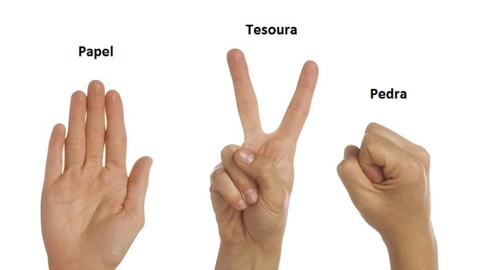

    
27/10/2022
Criar servidor que simule um aplicativo de banco

<input type="checkbox">
</input>1. Simular a criação de um novo usuário (POST)   
<input type="checkbox">
</input>2. Simular entrada do usuário no aplicativo (GET)  
<input type="checkbox">
</input>3. Simular a alteração da senha do usuário (PUT/PATCH)  
<input type="checkbox">
</input>4. Simular deletando o usuário (DELETE)  
<input type="checkbox">
</input>5. Simular mostrar todos os usuários logados no aplicativo (GET)  
<input type="checkbox">
</input>6. Simular a busca do usuário por ID (GET) 
  
    

28/10/2022
Criar servidor que simule o jogo de pedra, papel e tesoura

<input type="checkbox">
</input>1. Simular um jogo de pedra, papel e tesoura com 2 jogadores e todas as possibilidades de jogada  
<input type="checkbox">
</input>2. Simular a substituição de jogadores [pode ser de 1 ou dos dois] 
<input type="checkbox">
</input>3. Simular a exclusão de jogadores [pode ser de 1 ou dos dois] 
<input type="checkbox">
</input>4. Simular o cadastro de novos jogadores para o jogo [a depender da quantidade excluida de cima, precisa repor]
  
    

Criar servidor que simule uma fila de pedidos de uma lanchonete

